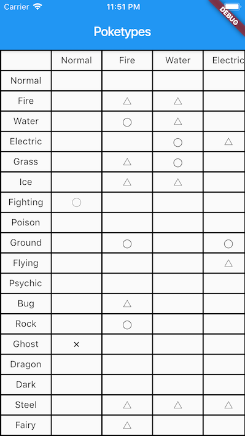

# Poketypes

[](https://circleci.com/gh/tnantoka/poketypes)

## Adding Poketypes to your project

```
dependencies:
  poketypes:
```

## Usage

```
import 'package:poketypes/poketypes.dart';

print(Poketype('normal').effectiveness['ghost']); // 0.0
```

## Example


